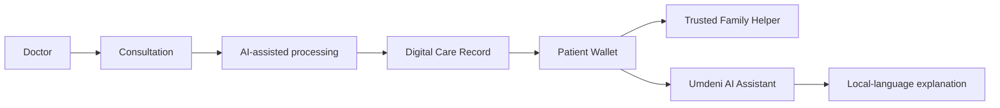
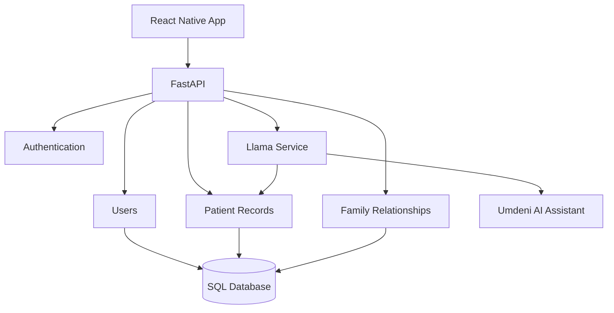

<div align="center">

# 🏥 Umdeni Health

**A privacy-first, offline-ready digital health wallet designed to bridge the gap between the clinic, the patient and the family.**


</div>

**Umdeni** means *family* in isiZulu.

Umdeni Health explores a simple idea: healthcare information should not stop at the consultation room.

The platform is designed to help clinicians create clearer digital records, help patients understand their care instructions, and help trusted family members support them at home.

It is especially designed around South African realities such as language barriers, lost paper records, unreliable connectivity and families playing an important role in elderly care.

<p align="center">
  
</p>

<p align="center">
  <b>Umdeni AI Assistant</b> — a friendly, patient-facing digital health companion designed to explain, guide and support.
</p>

## The problem

A patient may leave a consultation with important information about:

- a diagnosis
- medication
- dosage instructions
- follow-up care
- future appointments

But several things can go wrong after that.

### 📄 Records can disappear

Paper patient files can be lost, damaged or unavailable during the next visit.

### 🗣️ Medical language can be difficult to understand

A clinician may explain something in English using medical terminology while the patient is more comfortable speaking another language.

### 👨‍👩‍👧 Families often help with care

Family members may be responsible for medication, transport, appointments or daily support without having a clear view of the care instructions.

Umdeni Health tries to connect those three parts of the journey.

```text
Clinic
  ↓
Patient
  ↓
Family support at home
```

## Three experiences, one care journey

Umdeni Health has three main user roles:



## 🩺 Doctor experience

The clinician side is designed around capturing and structuring a consultation.

The larger product vision is:

```text
Consultation
    ↓
Capture clinical information
    ↓
Llama extracts structured information
    ↓
Doctor reviews the result
    ↓
Digital record created
    ↓
QR code generated
    ↓
Patient receives the record
```

The goal is to transform unstructured consultation information into something that can be stored and understood later.

### Intended structured information

The AI layer is designed to identify information such as:

```json
{
  "diagnosis": "Sinus infection",
  "medication": "Amoxicillin",
  "instructions": "Take after meals",
  "icd10_code": "..."
}
```

The clinician remains part of the process rather than treating AI-generated information as automatically correct.

## 👵 Patient experience

The patient application is intentionally different from a typical medical dashboard.

The design focuses on:

- large touch targets
- high-contrast UI
- simple medication information
- minimal navigation
- voice-first explanations
- local-language support

The patient dashboard is designed around understandable instructions instead of dense clinical information.

```text
Hello, Gogo

🔊 LALELA

My Medicine

Medication A
Take one tablet after breakfast

Medication B
Take in the evening
```

The goal is for important care information to be understandable without forcing the patient to interpret clinical terminology.

## 🤖 Umdeni AI Assistant

The Umdeni AI Assistant is the patient-facing digital companion inside the platform.

Instead of presenting AI as a technical chatbot, the assistant is designed to feel warm, familiar and supportive.

The assistant can eventually help users:

- understand medication instructions
- hear care information read aloud
- receive simplified explanations
- switch between supported languages
- understand appointment information
- navigate the application
- ask simple questions about their care record
- know when they should contact a healthcare professional

The assistant is intentionally designed as a Black African healthcare companion so the product feels more locally grounded and representative of the people it is designed for.

```text
Patient question
      ↓
Umdeni AI Assistant
      ↓
Patient care context
      ↓
Safe simplified explanation
      ↓
Voice / text response
```

The assistant is not intended to diagnose conditions or replace a doctor.

Its role is to help users **understand information already provided as part of their care**.

## 🤝 Family helper experience

Healthcare often continues at home.

Umdeni Health includes a family role so that an authorised helper can support the patient.

The family dashboard is designed around:

- care updates
- medication information
- upcoming appointments
- AI-assisted questions
- patient support

The idea is not to expose medical information to everyone.

The patient should control who is allowed to participate in their care.

## 🧠 AI-assisted health explanations

Umdeni Health uses Meta Llama as an AI reasoning layer.

The project explores three main uses.

### 1. Structured extraction

Convert consultation information into structured data that the application can store.

```text
Unstructured consultation
        ↓
      Llama
        ↓
Structured care record
```

### 2. Translation and simplification

Medical language can be transformed into clearer explanations.

For example:

```text
Clinical:
"Take one tablet orally twice daily."

Simplified:
"Take one pill in the morning and one in the evening."
```

The long-term goal is to make those explanations available in South African languages.

### 3. Family support

Trusted family helpers can use the patient's care context when asking questions about how to support them.

AI-generated information is intended to support understanding, not replace professional medical advice.

## 🌍 Language support

Language is a core part of the project rather than an optional feature.

The mobile application includes a shared language context and translation structure so different parts of the UI can adapt to the user's selected language.

The broader goal includes support for languages such as:

```text
English
isiZulu
Sesotho
and other South African languages
```

## 📱 Mobile architecture

The mobile application uses React Native with Expo.

The project separates the main experiences by user role:

```text
mobile-app/
├── app/
│   ├── (auth)/
│   │   ├── doctor-login.tsx
│   │   ├── family-login.tsx
│   │   └── patient-login.tsx
│   │
│   ├── (doctor)/
│   │   ├── consult.tsx
│   │   └── dashboard.tsx
│   │
│   ├── (patient)/
│   │   ├── dashboard.tsx
│   │   └── explainer.tsx
│   │
│   ├── (family)/
│   │   └── dashboard.tsx
│   │
│   └── context/
│       └── LanguageContext.tsx
│
├── components/
│   ├── AudioWaveform.tsx
│   ├── OfflineBadge.tsx
│   ├── TealCard.tsx
│   └── VoiceButton.tsx
│
├── database/
├── services/
└── assets/
```

Keeping the roles separated makes it easier to design each interface around what that user actually needs.

## ⚙️ Backend architecture

The backend is built with FastAPI.



The current backend includes routes for:

- user registration
- user login
- authenticated user retrieval
- patient creation
- patient records
- family-member relationships
- AI-generated patient summaries

## Authentication

Users can register with different roles.

Examples include:

```text
doctor
patient
family
```

Login returns a bearer token that can be used to access authenticated routes.

```text
Register / Login
      ↓
FastAPI
      ↓
Password verification
      ↓
JWT generated
      ↓
Authenticated requests
```

Passwords are hashed before being stored.

## Family relationships

The backend models relationships between a patient and family members.

This is important because family access should not simply mean:

```text
Anyone who knows the patient can view the record.
```

Instead, the architecture is moving toward explicit, authorised relationships between users.

## QR-based transfer

One of the most interesting parts of the product vision is transferring a consultation record from a clinic to a patient's phone using a QR code.

The intended flow is:

```text
Doctor finishes consultation
          ↓
Digital record generated
          ↓
QR code created
          ↓
Patient scans code
          ↓
Record saved to patient wallet
```

This approach could reduce dependence on continuous internet connectivity during the clinic-to-patient handoff.

## Offline-first direction

Offline access is a major part of the project vision.

The mobile application already contains local database and offline-related structure.

The long-term goal is for important patient information to remain available even when:

- mobile data is unavailable
- connectivity is unreliable
- the clinic network is down
- the user is experiencing load shedding

The system should synchronise when connectivity becomes available again.

## Privacy-first direction

Health information is highly sensitive.

The architecture is therefore intended to minimise unnecessary movement of patient information.

The longer-term design includes exploring local or clinic-hosted AI inference so patient data does not need to leave the healthcare environment for routine processing.

That is also why local storage, explicit family access and offline capability are important parts of the design.

## Tech stack

| Area | Technology |
|---|---|
| **Mobile** | React Native, Expo, TypeScript |
| **Backend** | Python, FastAPI |
| **Data access** | SQLModel |
| **Authentication** | JWT, password hashing |
| **AI** | Meta Llama integration |
| **AI experience** | Umdeni AI Assistant |
| **Local data** | SQLite / local-first architecture |
| **Languages** | Shared translation context |
| **Transfer** | QR-code based record sharing |
| **Design focus** | Accessibility, offline use, multilingual UX |

## Run the backend

```bash
cd backend
pip install -r requirements.txt
uvicorn app:app --reload
```

## Run the mobile app

```bash
cd mobile-app
npm install
npx expo start
```

## Current status

Umdeni Health is an evolving prototype.

Some parts of the full product vision are already implemented, while others are still being developed.

### Currently represented in the codebase

- role-based mobile experiences
- doctor dashboard
- patient dashboard
- family dashboard
- language context
- FastAPI backend
- user registration
- login and token authentication
- patient records
- family relationships
- Llama-backed patient summary
- QR-code service structure
- local database structure
- voice and offline UI components

### Still being developed

- complete consultation recording flow
- production-ready speech transcription
- doctor review and approval workflow
- complete QR record transfer
- full offline synchronisation
- persistent mobile records
- production-ready multilingual voice output
- interactive Umdeni AI Assistant
- richer family permissions
- robust medical-AI safety controls

## What makes this project interesting to me

Umdeni Health is not just an exercise in building screens.

It combines several problems I want to understand better:

```text
Mobile UX
+
Backend development
+
AI integration
+
Authentication
+
Offline-first systems
+
Accessibility
+
Multilingual design
+
Sensitive-data architecture
```

The biggest lesson from the project is that technology needs to adapt to the environment in which people actually use it.

For Umdeni Health that means thinking about language, connectivity, age, family support and privacy at the same time.

## What's next

- [ ] Integrate the Umdeni AI Assistant into the patient experience
- [ ] Complete the doctor consultation workflow
- [ ] Add structured consultation extraction
- [ ] Add clinician confirmation before saving AI-generated records
- [ ] Complete QR record transfer
- [ ] Persist patient records locally on the mobile device
- [ ] Add offline synchronisation
- [ ] Complete multilingual explanations
- [ ] Add text-to-speech for patient instructions
- [ ] Strengthen patient-to-family permission controls
- [ ] Add automated backend tests
- [ ] Add mobile component and flow tests
- [ ] Add audit logging for access to health records
- [ ] Improve AI safety and validation
- [ ] Add screenshots of the doctor, patient and family experiences
- [ ] Record a full doctor → patient → family demo

---

<p align="center">Built in South Africa 🇿🇦</p>
